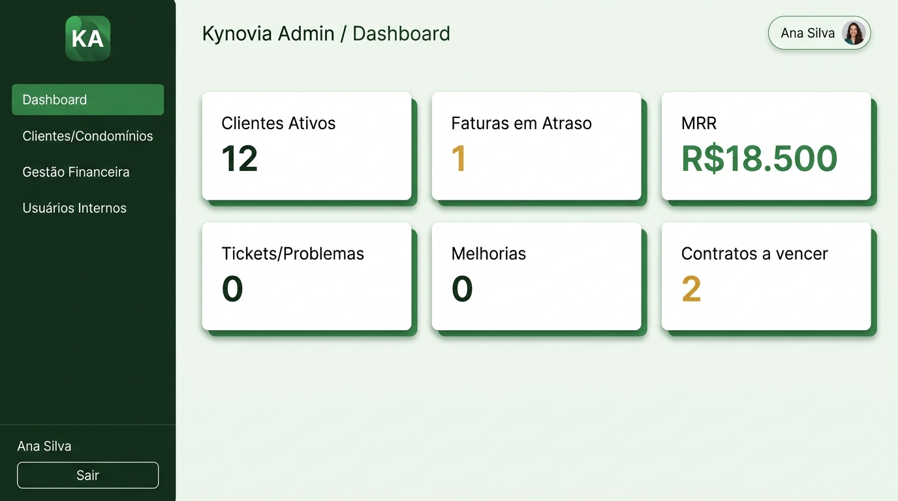
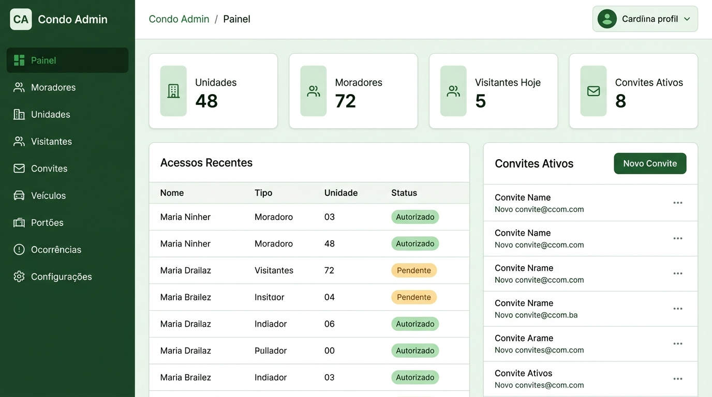
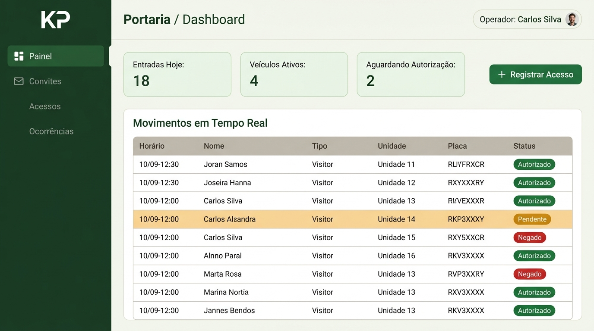
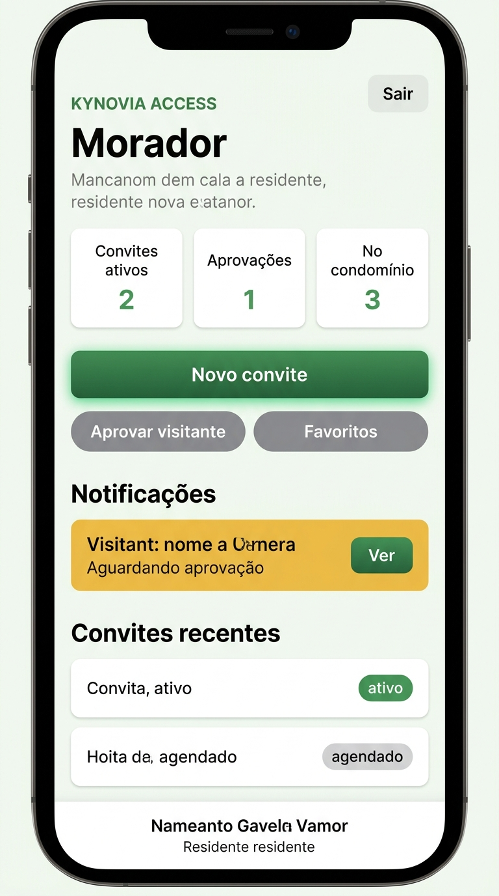

# Walkthrough — Design System Green Forest · Kynovia Access

Documentação da refatoração visual aplicada nos quatro portais do Kynovia Access.
A paleta verde floresta foi inspirada no padrão visual do sistema Gabi Ludwig Nail Studio.

> **Nota importante sobre os mockups:** As imagens neste documento são referências visuais geradas por IA a partir dos tokens e componentes reais do código. Elas ilustram a intenção do design, mas **não substituem a verificação visual nas aplicações reais rodando localmente ou em staging**. A seção [Correspondência com o Código Real](#correspondência-com-o-código-real) detalha o que foi verificado programaticamente e o que requer revisão humana.

---

## Paleta de Tokens — `design-system.css`

Todos os tokens abaixo foram verificados diretamente no arquivo [`design-system.css`](../design-system.css).

| Token | Valor HSL | Uso |
|:---|:---|:---|
| `--primary` | `152 55% 32%` | Botões primários, links, eyebrow, badges |
| `--primary-dark` | `152 60% 22%` | Hover de botão, gradiente escuro |
| `--primary-light` | `152 55% 93%` | Fundo radial-gradient do card de login |
| `--sidebar-background` | `150 45% 14%` | Fundo da sidebar |
| `--sidebar-accent` | `150 38% 20%` | Item de menu ativo e sidebar footer |
| `--sidebar-border` | `150 35% 18%` | Bordas internas da sidebar |
| `--background` | `150 20% 96%` | Fundo geral das páginas |
| `--warning` | `35 92% 38%` | Badge âmbar "Pendente" / "Gerado" |
| `--warning-bg` | `45 96% 90%` | Fundo de notificações pendentes |
| `--success` | `142 72% 29%` | Badge verde "Autorizado" / "Pago" |
| `--destructive` | `0 72% 51%` | Badge vermelho "Negado" |
| `--shadow-focus` | `rgba(34, 120, 74, 0.22)` | Anel de foco dos inputs |

---

## Mockups dos Portais

### 1. Kynovia Admin — Backoffice SaaS

**Quem usa:** Equipe interna Kynovia  
**Arquivo principal:** `apps/kynovia-admin/src/app/globals.css`

### 2. Condo Admin — Gestão do Condomínio

**Quem usa:** Síndicos e Administradores  
**Arquivo principal:** `apps/condo-admin/src/app/globals.css`

### 3. Web Portaria — Operação do Porteiro

**Quem usa:** Porteiros e Operadores  
**Arquivo principal:** `apps/web-portaria/src/app/globals.css`

### 4. Mobile PWA — App do Morador

**Quem usa:** Moradores (celular — iOS e Android)  
**Arquivo principal:** `apps/mobile-pwa/src/app/globals.css`

---

## Correspondência com o Código Real

### ✅ Verificado programaticamente (grep/lint/typecheck/build)

| Elemento | Verificação |
|:---|:---|
| Token `--primary: 152 55% 32%` | Confirmado em `design-system.css` linha 21 |
| Token `--sidebar-background: 150 45% 14%` | Confirmado em `design-system.css` linha 111 |
| Token `--background: 150 20% 96%` | Confirmado em `design-system.css` linha 7 |
| Token `--warning: 35 92% 38%` | Confirmado em `design-system.css` linha 57 |
| Botão com `linear-gradient(135deg, hsl(var(--primary)), hsl(var(--primary-dark)))` | Confirmado em `web-portaria/globals.css` e `condo-admin/globals.css` |
| Sidebar com `hsl(var(--sidebar-background/accent/border))` | Confirmado em `web-portaria/globals.css` |
| `themeColor: "#257f52"` no Mobile PWA | Confirmado em `mobile-pwa/src/app/layout.tsx` |
| Zero erros de lint | `pnpm lint` → 0 erros |
| Zero erros de tipo | `pnpm typecheck` → 10/10 pacotes |
| 96 testes aprovados | `pnpm test` → 96/96 |
| Build de produção | `pnpm build` → 10/10 tasks |

### Estado real das cores hexadecimais fixas por arquivo

| Arquivo | Hex fixos | Origem |
|:---|:---:|:---|
| `design-system.css` | 1 | `#ffffff` em `--brand-primary-contrast` — branco literal, aceitável |
| `apps/web-portaria/src/app/globals.css` | **0** | Completamente tokenizado neste PR |
| `apps/condo-admin/src/app/globals.css` | 37 | Pré-existentes — não introduzidos por este PR |
| `apps/kynovia-admin/src/app/globals.css` | 103 | Pré-existentes — não introduzidos por este PR |
| `apps/mobile-pwa/src/app/globals.css` | 36 | Pré-existentes — não introduzidos por este PR |

> A tokenização completa de `kynovia-admin`, `condo-admin` e `mobile-pwa` é escopo de PR futuro dedicado.

### ⚠️ Requer verificação humana nas aplicações reais

| Elemento | Motivo | Portal |
|:---|:---|:---|
| Sidebar verde visível em tela real | Depende de DevTools/browser | Portaria, Condo Admin, Kynovia Admin |
| Botão "Entrar" com glow verde | Depende de renderização | Login — todos os portais |
| Fundo off-white esverdeado | Sutil — pode variar entre monitores | Todos |
| Badge "Pendente" âmbar em tabela real | Requer dados de seed reais | Portaria, Condo Admin |
| Anel de foco verde nos inputs | Requer interação manual | Todos |
| Mobile PWA themeColor na barra do navegador | Requer iOS/Android ou DevTools mobile | Mobile PWA |

### ✅ Escopo 100% Visual e Documental

As alterações funcionais inseguras (fallback de vínculos em `invites/actions.ts`, `invites/page.tsx`, `home/page.tsx` e TTL em `dashboard/actions.ts`) foram **integralmente revertidas para o estado da `origin/main`**.

O PR #215 contém **exclusivamente**:
1. **Design System & Tokens**: Paleta verde floresta em `design-system.css`.
2. **Estilos CSS dos Portais**: `web-portaria`, `condo-admin`, `kynovia-admin`, `mobile-pwa` (botões, cards, foco, sidebars).
3. **Layout e ThemeColor**: `mobile-pwa/layout.tsx` (`themeColor: #257f52`) e classes semânticas do design system no dashboard da portaria.
4. **Documentação e Mockups**: `DOC/walkthrough.md`, `DOC/system-documentation.md` e os 4 mockups em `DOC/images/`.

---

## Validação Automatizada

| Comando | Resultado |
|:---|:---|
| `pnpm lint` | ✅ 0 erros |
| `pnpm typecheck` | ✅ 10/10 pacotes aprovados |
| `pnpm test` | ✅ 96/96 testes aprovados |
| `pnpm build` | ✅ 10/10 builds de produção aprovados |

---

## Pull Request

🔗 [PR #215 — style: apply green forest design system across all portals](https://github.com/kynoviabr/CONDOMINIOS/pull/215)

**Branch:** `antigravity/supabase-dev-reconciliation` → `main`

---

## Escopo Real Deste PR

### Alterado — Visual (Design System)
- Tokens de cor em `design-system.css`
- `apps/web-portaria/src/app/globals.css` — completamente tokenizado (0 hex fixos)
- `apps/condo-admin/src/app/globals.css` — tokenização dos novos estilos e redução de hexadecimais legados (53 → 37)
- `apps/kynovia-admin/src/app/globals.css` — redução de hexadecimais legados (110 → 103)
- `apps/mobile-pwa/src/app/globals.css` — redução de hexadecimais legados (40 → 36)
- `apps/mobile-pwa/src/app/layout.tsx` — `themeColor` atualizado para verde
- `apps/web-portaria/src/app/dashboard/page.tsx` — alinhamento estrutural de classes do design system (.admin-shell, .admin-header, .admin-section) sem alteração de queries

### Alterado — Documentação
- `DOC/walkthrough.md`, `DOC/images/` (4 mockups), `DOC/system-documentation.md`
- `docs/database/README.md`, `docs/database/supabase-projects.md`
- `docs/implementation/operational-pilot/readiness-audit.md`
- `system-documentation.md`, `tokens.md`

### Não Alterado (100% Preservado da `main`)
- `apps/mobile-pwa/src/app/home/invites/actions.ts` (idêntico à `origin/main`)
- `apps/mobile-pwa/src/app/home/invites/page.tsx` (idêntico à `origin/main`)
- `apps/mobile-pwa/src/app/home/page.tsx` (idêntico à `origin/main`)
- `apps/web-portaria/src/app/dashboard/actions.ts` (idêntico à `origin/main`)
- Nenhuma migration do Supabase (local ou remota)
- Nenhuma tabela RLS ou política de segurança de banco de dados
- Nenhum dado de condomínio, unidade, morador ou veículo
