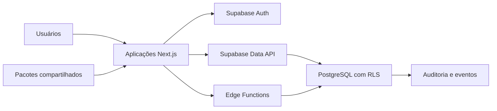
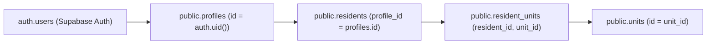

# Kynovia Access — Documentação geral do sistema

> Documento de continuidade e guarda do projeto no estado de 18 de agosto de 2026.
>
> Este documento não contém senhas, chaves privadas, `service_role` ou outros segredos. Valores sensíveis devem permanecer apenas em `.env.local` ou no gerenciador de segredos do ambiente.

## 1. Resumo executivo

Kynovia Access é uma plataforma SaaS multiempresa e multicondomínio para administração condominial e controle de acesso. O sistema está organizado como um monorepo e separa as responsabilidades entre administração interna da Kynovia, administração do condomínio, operação da portaria e experiência móvel do morador.

O portal mais desenvolvido neste ponto é o **Condo Admin**, acessível localmente em `http://localhost:3004`. Ele concentra cadastros e operações do condomínio autenticado, com controle de acesso por perfil e isolamento dos dados no Supabase por `tenant_id` e `condominium_id`.

### Referência rápida

| Item | Valor atual |
| --- | --- |
| Repositório local | `/Users/fernandoluizbraidotti/Documents/CONDOMINIOS` |
| Branch de trabalho | `antigravity/unidades-checkpoint` |
| Aplicação principal atual | `apps/condo-admin` |
| URL local do Condo Admin | `http://localhost:3004` |
| Projeto Supabase remoto | `Condominios` |
| Project reference | `fviiwvpcbsriemmxpjxo` |
| API URL | `https://fviiwvpcbsriemmxpjxo.supabase.co` |
| Conta administrativa conhecida | `kynoviabr.bb@gmail.com` |
| Gerenciador de pacotes | pnpm 9.15.4 |
| Runtime recomendado | Node.js 20 ou superior |

A senha da conta não deve ser registrada em documentação ou versionada. Se necessário, ela deve ser redefinida pelo fluxo de recuperação do Supabase Auth.

## 2. Objetivo e limites do produto

O produto deve atender quatro contextos distintos:

1. **Kynovia Admin:** backoffice interno para onboarding, suporte, ciclo de vida de clientes e visibilidade entre condomínios quando autorizada.
2. **Condo Admin:** gestão operacional dos dados do próprio condomínio.
3. **Portaria:** operação em tempo real, validação de acessos, eventos, ocorrências e rotinas do porteiro.
4. **Mobile PWA:** identidade e autosserviço do morador, convites, aprovações e histórico de acesso.

O Condo Admin não deve acessar dados de outro condomínio. A Portaria não deve virar um backoffice administrativo. O Mobile PWA não deve receber funções internas de gestão da Kynovia.

## 3. Arquitetura



### Stack

- Next.js 15, React 19 e TypeScript.
- Tailwind CSS e componentes compartilhados em `@kynovia/ui`.
- Supabase Auth, Data API, PostgreSQL, RLS, Storage e Edge Functions.
- pnpm workspaces e Turborepo.
- ESLint, TypeScript, Vitest e builds do Next.js para qualidade.

### Estrutura do monorepo

| Caminho | Porta | Responsabilidade | Situação |
| --- | ---: | --- | --- |
| `apps/web-admin` | 3000 | Aplicação administrativa legada | Mantida durante a migração |
| `apps/web-portaria` | 3001 | Operação da portaria | Base existente |
| `apps/mobile-pwa` | 3002 | Experiência móvel do morador | Base existente |
| `apps/kynovia-admin` | 3003 | Backoffice interno da Kynovia | Estrutura em evolução |
| `apps/condo-admin` | 3004 | Administração do condomínio | Aplicação principal atual |
| `packages/ui` | — | Componentes e variantes visuais compartilhados | Compartilhado |
| `packages/database` | — | Clientes, tipos e auxiliares de banco | Compartilhado |
| `packages/auth` | — | Contratos e limites de autenticação/autorização | Compartilhado |
| `packages/access-engine` | — | Contratos de decisão de acesso | Fundação |
| `packages/integrations` | — | Contratos para provedores externos | Fundação |

## 4. Condo Admin

### Rotas

- `/login`
- `/reset-password`
- `/access-denied`
- `/dashboard`
- `/dashboard/units`
- `/dashboard/residents`
- `/dashboard/vehicles`
- `/dashboard/gates`
- `/dashboard/employees`
- `/dashboard/suppliers`
- `/dashboard/visitors`
- `/dashboard/invites`
- `/dashboard/doorman`
- `/dashboard/occurrences`
- `/dashboard/settings`

### Módulos por maturidade

| Módulo | Estado atual |
| --- | --- |
| Dashboard | Disponível |
| Unidades | Disponível: cadastro, consulta e filtragem |
| Moradores | Disponível: cadastro, consulta, edição e validações de formulário |
| Veículos | Disponível: cadastro, consulta, edição e vínculo com moradores |
| Portões e cancelas | Disponível como base operacional |
| Visitantes | Disponível como base operacional |
| Convites | Disponível, incluindo blacklist de placas |
| Ocorrências | Disponível como base operacional |
| Configurações | Disponível como base administrativa |
| Funcionários | Fundação; requer completar fluxos de produto |
| Prestadores | Fundação; requer completar fluxos de produto |
| Portaria no Condo Admin | Fundação; a operação principal pertence ao app de Portaria |

### Regras de acesso por módulo

- `condominium_admin`, `manager` e `syndic`: acesso aos módulos administrativos do condomínio.
- `doorman_supervisor`: visitantes, convites, portões, portaria e ocorrências.
- `resident_manager`: unidades, moradores, veículos, visitantes e convites.

O contexto ativo é resolvido pelo perfil autenticado e por uma associação em `condominium_memberships`. A consulta também exige o mesmo `tenant_id` do perfil. Na ausência de associação específica, o código atual procura o primeiro condomínio disponível no tenant; essa estratégia deve ser substituída por uma seleção explícita caso um usuário passe a administrar mais de um condomínio.

## 5. Funcionalidades implementadas até este ponto

### Unidades

- Formulário de nova unidade exibido antes da listagem.
- Campo apresentado como **Bloco/Quadra**.
- Cadastro de bloco/quadra, número e andar.
- Consulta e filtragem de unidades.
- Listagem ajustada para evitar rolagem horizontal em desktop.
- Acesso à Data API concedido por migração e protegido por RLS.

### Moradores

- Cadastro e edição vinculados a uma unidade do condomínio ativo.
- CPF com máscara e validação dos dígitos verificadores ao perder o foco.
- CPF, data de nascimento, telefone, WhatsApp e e-mail tratados como obrigatórios.
- Validação visual dos campos ao perder o foco.
- Cálculo e exibição da idade em anos e meses.
- Organização compacta dos campos em linhas relacionadas.
- Criação de unidade por janela modal sem sair do cadastro de morador.
- Status exposto na interface apenas como **Ativo** ou **Inativo**.
- Campo e opção de bloqueio removidos do fluxo de moradores.
- Botão principal denominado **Salvar Morador**.
- Resumo da listagem mostra somente nome e unidade; os demais dados aparecem na edição/detalhe.
- Veículos cadastrados aparecem ao lado dos moradores na parte inferior da tela.

Observação: o banco ainda pode preservar valores e estruturas históricas de bloqueio por compatibilidade. A política atual da interface é não bloquear moradores, somente inativá-los quando deixarem de fazer parte do condomínio.

### Veículos

- Formulário de novo veículo antes da listagem.
- Campos dimensionados para permanecer dentro do card.
- KPIs Encontrados, Ativos e Bloqueados compactados na mesma linha.
- Seleção dependente de marca e modelo.
- Catálogo local com marcas relevantes do Brasil e modelos atuais/históricos, incluindo Volkswagen Fox.
- Preservação de valores existentes que ainda não estejam no catálogo.
- Placa aceita os padrões brasileiro antigo (`ABC-1234`) e Mercosul (`ABC1D23`).
- Edição em modal amplo, aberta pelo veículo ou pelo botão Editar, sem depender de uma tabela horizontal extensa.

O catálogo de marcas e modelos é uma conveniência de interface e não é uma base automotiva oficial ou exaustiva. Para cobertura integral, deve ser substituído por uma fonte versionada e confiável, com estratégia para modelos descontinuados.

### Convites e blacklist de placas

- Consulta de placas presentes na blacklist.
- Estado apresentado em português como bloqueado ou desbloqueado.
- Item bloqueado oferece ação **Desbloquear**.
- Item inativo oferece ação **Bloquear novamente**.
- As ações validam tenant e condomínio e verificam se o registro correto foi atualizado.

### Identidade visual

- Sidebar azul-marinho, ações primárias em roxo e conteúdo em cards claros.
- Tela de login alinhada ao padrão do produto.
- Telas administrativas orientadas a leitura rápida, ações claras e estados sem ambiguidade.
- Referência oficial: `docs/design-system/security-gatehouse-design-system.md`.

## 6. Modelo de dados

As migrações em `supabase/migrations` são a fonte de verdade da estrutura. Nunca alterar o banco somente pelo painel sem criar a migração correspondente.

### Núcleo organizacional

- `tenants`: cliente/organização SaaS.
- `condominiums`: condomínio pertencente a um tenant.
- `profiles`: identidade de aplicação associada ao usuário autenticado.
- `condominium_memberships`: associação do perfil ao condomínio e papel operacional.
- `units`: unidades residenciais do condomínio.
- `access_points`: portões, cancelas e outros pontos de acesso.

### Moradores, visitantes e veículos

- `residents`
- `resident_units`
- `resident_vehicles`
- `visitors`
- `visitor_vehicles`
- `visitor_unit_visits`
- `resident_favorite_visitors`

### Convites e decisões de acesso

- `access_invites`
- `access_invite_validations`
- `vehicle_plate_blacklist`
- `visitor_vehicle_accesses`
- `resident_access_approvals`

### Operação, auditoria e IA

- `access_events`
- `gate_commands`
- `gatehouse_occurrences`
- `audit_logs`
- `audit_retention_policies`
- `audit_log_export_requests`
- `operational_ai_analyses`
- `operational_ai_alerts`
- `doorman_assistant_sessions`
- `doorman_assistant_messages`

### Histórico de migrações

Existem 21 migrações SQL nesta cópia do repositório, cobrindo:

1. esquema inicial e fundação;
2. endurecimento das funções auxiliares de RLS;
3. administração de condomínios;
4. moradores, veículos e visitantes;
5. convites digitais e QR Code;
6. convites e blacklist por placa;
7. operação de portaria;
8. fundação do aplicativo do morador;
9. auditoria e conformidade;
10. IA operacional;
11. campos de veículos do Condo Admin;
12. integridade de veículos de moradores;

As três migrações de permissões de Data API e auxiliares de RLS descritas em um
checkpoint anterior não estão presentes nesta cópia e devem ser reconciliadas
antes de qualquer aplicação no ambiente remoto.

O detalhamento lógico do esquema está em `docs/database/schema.md`.

## 7. Segurança, autenticação e tenancy

### Regras obrigatórias

- Nenhuma chave `service_role` pode ser enviada ao navegador.
- Tabelas sensíveis devem ter RLS ativada.
- Dados do cliente devem carregar `tenant_id` e, quando aplicável, `condominium_id`.
- Toda consulta e mutação deve ser limitada ao contexto autenticado.
- Mudanças de banco devem ser realizadas por migrações.
- Segredos não devem ser versionados.
- Ações sensíveis devem produzir trilha de auditoria quando aplicável.

### Fluxo de autenticação

1. O usuário entra com e-mail e senha no Supabase Auth.
2. O servidor recupera a sessão e o `profile` correspondente.
3. O Condo Admin exige um perfil autorizado.
4. A associação em `condominium_memberships` determina o condomínio ativo.
5. As políticas RLS repetem a barreira de autorização no banco.

Uma conta criada apenas no Supabase Auth não é suficiente: ela também precisa de `profile`, tenant válido e associação ao condomínio. Sem isso, o sistema direciona para acesso negado por perfil ausente ou não autorizado.

### Papéis

O projeto possui papéis históricos gerais — como `platform_admin`, `tenant_admin`, `condominium_admin`, `gatehouse_operator` e `resident` — e papéis operacionais específicos do Condo Admin — `syndic`, `manager`, `doorman_supervisor` e `resident_manager`. A taxonomia deve ser normalizada em uma migração futura para impedir divergência entre documentação, tipos, políticas e interface.

## 8. Supabase

### Ambiente remoto em uso

- Projeto: `Condominios`
- Reference: `fviiwvpcbsriemmxpjxo`
- API URL: `https://fviiwvpcbsriemmxpjxo.supabase.co`
- Conta administrativa conhecida: `kynoviabr.bb@gmail.com`

A chave pública deve ser obtida no painel do projeto em **Settings → API Keys** ou no bloco **Get connected → API Keys**. Mesmo sendo uma chave destinada ao cliente, ela não deve ser copiada para este documento; deve ficar em `.env.local`.

### Ambiente local opcional

O Supabase local usa Docker. As portas configuradas são:

| Serviço | Porta |
| --- | ---: |
| API local | 54321 |
| PostgreSQL | 54322 |
| Studio local | 54323 |

`http://127.0.0.1:54321` é a API, não a interface do Studio. Quando o ambiente local estiver iniciado, o Studio fica normalmente em `http://127.0.0.1:54323`.

Comandos:

```bash
supabase start
supabase status
supabase db reset
```

`supabase db reset` recria o banco local, aplica todas as migrações e executa `supabase/seed.sql`. É destrutivo para os dados do ambiente local.

### Aplicação de migrações remotas

```bash
supabase login
supabase link --project-ref fviiwvpcbsriemmxpjxo
supabase db push
```

Antes de aplicar uma migração remota, revisar o SQL, obter backup adequado e confirmar que o projeto vinculado é o correto.

### Backup e restauração

Banco de dados e Storage são artefatos diferentes:

- banco: dump SQL/PostgreSQL, migrações e dados;
- Storage: buckets, objetos e respectivas políticas/metadados;
- Auth: usuários e identidades exigem tratamento próprio e seguro.

O arquivo de Storage recebido anteriormente não comprova, sozinho, uma restauração completa do sistema. Não há neste checkpoint evidência documentada de que o arquivo legado `gexmghjenqourlovtelj.storage.zip` tenha sido integralmente restaurado e validado no projeto atual. Antes de produção, comparar buckets, objetos, políticas e referências do banco.

## 9. Variáveis de ambiente

O contrato público está em `.env.example`. Para o Condo Admin conectado ao Supabase, as variáveis mínimas são:

```dotenv
NEXT_PUBLIC_SUPABASE_URL=
NEXT_PUBLIC_SUPABASE_ANON_KEY=
NEXT_PUBLIC_SUPABASE_PUBLISHABLE_KEY=
```

Dependendo da geração das chaves do projeto, a aplicação pode usar a chave `anon` legada ou a chave `publishable`. Respeitar o fallback implementado nos clientes Supabase do projeto.

Outras categorias previstas no arquivo de exemplo:

- URLs das cinco aplicações;
- IDs de projeto para desenvolvimento, staging e produção;
- autenticação e cookie de sessão;
- tenant e condomínio padrão;
- WhatsApp, e-mail, SMS, leitura de placas e reconhecimento facial;
- IA operacional;
- observabilidade;
- CI/CD e deploy.

Segredos de servidor, senhas do banco, tokens de integração e `SUPABASE_SERVICE_ROLE_KEY` nunca devem usar prefixo `NEXT_PUBLIC_`.

## 10. Instalação e execução local

### Pré-requisitos

- Node.js 20 ou superior.
- Corepack/pnpm.
- Git.
- Docker Desktop somente se for usar Supabase local.
- Supabase CLI para migrações e ambiente local.

### Entrar na pasta

```bash
cd "/Users/fernandoluizbraidotti/Documents/ChatGPT/Condominio"
```

### Instalar dependências

```bash
corepack enable
pnpm install
```

### Configurar o ambiente

```bash
cp .env.example .env.local
```

Preencher `.env.local` com a API URL e a chave pública do projeto. Como os aplicativos podem carregar variáveis a partir do próprio diretório, confirmar também se `apps/condo-admin/.env.local` é necessário no fluxo local adotado. Nunca commitar esses arquivos.

### Executar somente o Condo Admin

```bash
pnpm --filter @kynovia/condo-admin dev
```

Abrir `http://localhost:3004/login`.

### Executar o monorepo

```bash
pnpm dev
```

Se a porta estiver ocupada, encerrar o processo anterior antes de iniciar outra instância. Depois de alterar `.env.local`, reiniciar o servidor Next.js; recarregar apenas o navegador pode não atualizar as variáveis.

## 11. Operação básica

### Acesso ao sistema

1. Abrir `http://localhost:3004/login`.
2. Entrar com uma conta existente no Supabase Auth.
3. Confirmar que existe um `profile` para o mesmo usuário.
4. Confirmar tenant, papel autorizado e associação ao condomínio.
5. Em erro `missing_profile`, corrigir o perfil e a associação; criar apenas o usuário de Auth não resolve.

### Cadastro recomendado

1. Cadastrar ou confirmar o condomínio.
2. Cadastrar unidades.
3. Cadastrar moradores e vinculá-los às unidades.
4. Cadastrar veículos e vinculá-los aos moradores quando aplicável.
5. Configurar pontos de acesso.
6. Cadastrar visitantes ou emitir convites.
7. Acompanhar eventos e ocorrências.

## 12. Validações de domínio atuais

- CPF: normalização, máscara e verificação matemática.
- Data de nascimento: obrigatória no cadastro de morador e usada no cálculo da idade.
- Telefone e WhatsApp: obrigatórios no cadastro de morador; manter normalização consistente antes de persistir.
- E-mail: obrigatório e validado no formulário.
- Unidade: deve pertencer ao tenant e condomínio ativos.
- Placa: normalizada para maiúsculas e validada como padrão antigo ou Mercosul.
- Status do morador: somente ativo/inativo na experiência atual.
- Mutação: deve confirmar que a linha realmente atualizada pertence ao contexto autenticado.

Validações de interface melhoram a experiência, mas não substituem validações no servidor, constraints do PostgreSQL e RLS.

## 13. Design system e UX

A referência visual está em `docs/design-system/security-gatehouse-design-system.md`.

Princípios aplicados:

- informação operacional importante no topo;
- estados e ações sem ambiguidade;
- formulários compactos com erros próximos aos campos;
- ação principal única e clara;
- cards, badges, botões, diálogos e tabelas consistentes;
- foco visível, contraste e navegação por teclado;
- estados de carregamento, vazio, sucesso e falha;
- cores semânticas centralizadas: `primary`, `success`, `warning`, `destructive`, `muted` e `info`.

O tema atual do Condo Admin usa azul-marinho, roxo e superfícies claras. Não criar cores específicas diretamente em uma página quando a semântica puder ser incorporada aos componentes compartilhados.

## 14. Testes e qualidade

Antes de abrir ou atualizar um Pull Request, executar obrigatoriamente:

```bash
pnpm lint
pnpm typecheck
pnpm test
pnpm build
```

Também devem ser realizados testes manuais dos fluxos alterados. Para o Condo Admin, o conjunto mínimo deste checkpoint é:

1. login e logout;
2. acesso negado para perfil inválido;
3. criar, listar e filtrar unidade;
4. criar e editar morador, incluindo CPF inválido e campos obrigatórios;
5. criar unidade pelo modal do formulário de morador;
6. criar e editar veículo com os dois padrões de placa;
7. dependência marca/modelo;
8. bloquear e desbloquear placa na blacklist;
9. confirmar isolamento entre condomínios;
10. verificar layout em desktop e tablet.

Checkpoint validado em 18 de agosto de 2026:

- `pnpm lint`: aprovado, sem erros ou avisos;
- `pnpm typecheck`: 10 de 10 pacotes aprovados;
- `pnpm test`: 10 arquivos e 66 testes aprovados;
- `pnpm turbo run build --force`: 10 de 10 builds aprovados, sem uso de cache;
- módulo de Unidades homologado manualmente para criação, consulta, edição,
  filtros e integridade de exclusão.

As validações devem ser repetidas caso qualquer arquivo seja alterado antes do PR.

## 15. Estado do versionamento neste checkpoint

- Branch atual: `antigravity/unidades-checkpoint`.
- Há alterações locais ainda não consolidadas em commit/PR.
- Áreas alteradas incluem dashboard, layout, unidades, moradores, veículos, convites, estilos globais, componentes e validadores.
- Esta cópia contém 21 migrações. As três migrações adicionais mencionadas em um
  checkpoint anterior ainda precisam ser reconciliadas.
- Não substituir nem descartar essas alterações sem revisar `git status` e `git diff`.

Comandos seguros para inspecionar:

```bash
git status --short
git diff --stat
git diff
```

O fluxo obrigatório é trabalhar em branch, validar, criar commits focados, publicar a branch e abrir Pull Request.

## 16. Pendências e riscos conhecidos

### Prioridade alta

- Repetir o ciclo completo de lint, typecheck, testes e build após qualquer nova alteração.
- Reconciliar as três migrações ausentes e confirmar quais migrações estão aplicadas no Supabase remoto correto.
- Testar RLS com pelo menos dois condomínios distintos.
- Criar uma política formal de backup e restauração para banco, Auth e Storage.
- Validar a restauração dos arquivos legados de Storage, caso ainda seja necessária.
- Normalizar a taxonomia de papéis entre banco, pacote de Auth, documentação e aplicações.

### Produto e UX

- Completar Funcionários e Prestadores.
- Evoluir a Portaria em seu aplicativo próprio, evitando duplicidade no Condo Admin.
- Revisar todas as telas em tablet e dispositivos menores.
- Garantir mensagens de erro acionáveis e preservação consistente do formulário em falhas do servidor.
- Substituir o catálogo estático de veículos se houver necessidade de cobertura oficial/exaustiva.

### Integrações e infraestrutura

- Configurar provedores de WhatsApp, e-mail, SMS, LPR e demais integrações somente quando houver variáveis e segredos gerenciados.
- Finalizar observabilidade, alertas e política de retenção.
- Definir ambientes separados de desenvolvimento, staging e produção.
- Atualizar o README, que ainda pode descrever partes do Condo Admin como apenas estrutura inicial.

## 17. Checklist de continuidade

Ao retomar o projeto:

1. Ler este documento e o `AGENTS.md`.
2. Confirmar branch e alterações locais com `git status --short`.
3. Verificar o projeto Supabase vinculado antes de qualquer `db push`.
4. Confirmar as variáveis locais sem expor seus valores.
5. Iniciar o Condo Admin e testar o login.
6. Executar os fluxos manuais relacionados à próxima alteração.
7. Implementar mudanças de banco somente via migração.
8. Executar o ciclo completo de qualidade.
9. Documentar checks indisponíveis e limitações no PR.
10. Atualizar este documento quando arquitetura, ambiente, papéis ou fluxos principais mudarem.

## 18. Documentos complementares

- `README.md`: visão geral e comandos iniciais.
- `AGENTS.md`: regras obrigatórias de arquitetura, segurança e entrega.
- `docs/database/schema.md`: descrição do esquema de banco.
- `docs/design-system/security-gatehouse-design-system.md`: referência visual e operacional.
- `docs/security/auth-rbac.md`: autenticação e RBAC.
- `docs/security/rls-policy-model.md`: modelo de políticas RLS.
- `.env.example`: contrato de configuração dos ambientes.
- `supabase/config.toml`: configuração do Supabase local.
- `supabase/migrations`: fonte de verdade do banco.

## 19. Política de atualização deste documento

Atualizar esta documentação sempre que ocorrer uma destas mudanças:

- criação ou remoção de aplicação, pacote ou módulo;
- alteração de porta ou URL operacional;
- mudança de projeto Supabase ou estratégia de ambientes;
- criação de papel ou alteração de permissão;
- mudança relevante no modelo de dados;
- nova integração externa;
- mudança nos fluxos de login, cadastro ou controle de acesso;
- conclusão de uma pendência listada neste checkpoint.

Registrar a data, a branch/versão e o resultado das validações. Nunca adicionar senhas, tokens ou chaves privadas.

## 20. Mobile PWA e Fluxo Operacional de Convites & Aprovações

### 20.1 Cadeia de Identidade e Autenticação do Morador
A identidade do morador segue uma cadeia relacional estrita e multi-tenant:



1. `auth.users`: Gerencia credenciais (e-mail e senha) e tokens JWT.
2. `public.profiles`: Armazena tenant do usuário (`tenant_id`) e papel de acesso (`resident`).
3. `public.residents`: Mantém os dados cadastrais do morador no condomínio (`condominium_id`), status de atividade (`status = 'active'` ou `'blocked'`).
4. `public.resident_units`: Associa o morador a uma ou mais unidades físicas do condomínio (`unit_id`), indicando relação (`owner`, `resident`, `tenant`, etc.) e se é unidade principal (`is_primary`).

### 20.2 Matriz de Privilégios (Princípio do Menor Acesso)
Todas as permissões foram estritamente restritas no PostgreSQL para evitar brechas de segurança:

| Tabela | Papel `anon` | Papel `authenticated` | `service_role` | Justificativa / Observação |
| :--- | :--- | :--- | :--- | :--- |
| `public.access_invites` | `REVOKE ALL` | `SELECT`, `INSERT`, `UPDATE` | `ALL` | Moradores não podem fazer `DELETE` direto (apenas cancelamento via `UPDATE` de status). Sem `TRIGGER`, `REFERENCES` ou `TRUNCATE`. |
| `public.resident_access_approvals` | `REVOKE ALL` | `SELECT`, `INSERT`, `UPDATE` | `ALL` | Operadores inserem solicitações; moradores atualizam status (aprovado/recusado). Sem `DELETE`, `TRIGGER` ou `TRUNCATE`. |
| `public.resident_favorite_visitors` | `REVOKE ALL` | `SELECT`, `INSERT`, `UPDATE`, `DELETE` | `ALL` | Moradores gerenciam sua lista de visitantes frequentes. Sem `TRIGGER` ou `TRUNCATE`. |
| `public.resident_units` | `REVOKE ALL` | `SELECT` | `ALL` | Somente leitura para vínculo de morador. Alterações cadastrais pertencem à administração. |
| `public.access_events` | `REVOKE ALL` | `SELECT`, `INSERT`, `UPDATE` | `ALL` | Histórico auditável de passagens físicas. Sem `DELETE`, `TRIGGER` ou `TRUNCATE`. |
| `public.access_invite_validations` | `REVOKE ALL` | `SELECT`, `INSERT` | `ALL` | Registro de conferência na portaria. Sem `DELETE` ou `UPDATE`. |
| `public.visitor_vehicle_accesses` | `REVOKE ALL` | `SELECT`, `INSERT`, `UPDATE` | `ALL` | Controle de veículos temporários no condomínio. |

### 20.3 Estratégia de Políticas RLS e Remoção de SECURITY DEFINER
- **Remoção de Funções SECURITY DEFINER Públicas**:
  - A função `public.is_current_resident_for_unit` foi completamente **removida** do schema `public`, eliminando superfícies de ataque e privilégios elevados.
- **Otimização de Subplanos**:
  - As políticas RLS utilizam escalares cacheados por consulta `(select auth.uid())` e `(select public.current_tenant_id())`, evitando reavaliações por linha.
- **Isolamento Estrito**:
  - Toda inserção e leitura em `public.access_invites` exige validação simultânea de:
    1. `tenant_id = (select public.current_tenant_id())`
    2. `profile_id = (select auth.uid())` com morador ativo (`status = 'active'`)
    3. `unit_id` vinculada em `public.resident_units`
    4. Coincidência estrita de `condominium_id` em toda a cadeia.

### 20.4 Funcionamento do QR Code Seguro
1. **Geração**: Ao criar um convite no PWA, um token criptograficamente seguro de 32 bytes (`randomBytes(32).toString("base64url")`) é gerado.
2. **Armazenamento Seguro**: Apenas o hash SHA-256 (`qr_token_hash`) é persistido no banco de dados. O token bruto nunca é salvo em texto claro.
3. **Payload**: O QR Code exibe o payload no formato `inviteId.token`.
4. **Validação na Portaria**: A portaria lê o QR Code, extrai o `inviteId` e o `token`, calcula o hash SHA-256 e compara com o `qr_token_hash` indexado no banco, conferindo validade temporal, limites de uso (`max_uses`) e blacklist.

### 20.5 Fluxo Operacional de Aprovações (Portaria ↔ Mobile PWA)
O fluxo atual é orquestrado de forma assíncrona e resiliente via Server Actions e revalidação de rotas Next.js:

1. **Solicitação na Guarita**: Quando um visitante sem convite chega à portaria, o operador preenche o formulário de despacho na aplicação Web Portaria (`apps/web-portaria`).
2. **Registro Pendente**: Um registro é criado em `public.resident_access_approvals` com `status = 'pending'`.
3. **Visualização no PWA**: O morador autenticado visualiza a solicitação pendente no painel de aprovações do Mobile PWA (`apps/mobile-pwa/src/app/home/invites`).
4. **Decisão do Morador**: O morador clica em "Autorizar" ou "Recusar". A Server Action atualiza `status = 'approved'` ou `'rejected'` com timestamp `decided_at` e `decided_by = (select auth.uid())`.
5. **Liberação**: A portaria consulta o status atualizado e procede com a liberação física e registro em `access_events`.

### 20.6 Testes Automatizados e de Integração RLS
A suíte de testes de banco e RLS está localizada em [`packages/database/src/invites-rls.test.ts`](file:///Users/fernandoluizbraidotti/Documents/CONDOMINIOS/packages/database/src/invites-rls.test.ts) e cobre:

1. Morador ativo criando convite para sua unidade vinculada (Permitido).
2. Morador criando convite para unidade de outro morador (Negado).
3. Morador tentando acessar outro condomínio (Negado).
4. Morador inativo criando convite (Negado).
5. Usuário autenticado sem vínculo residencial (Negado).
6. Usuário anônimo criando ou consultando convites (Negado).
7. Morador atualizando seu próprio convite (Permitido).
8. Morador atualizando convite de outro morador (Negado).
9. Tentativa de DELETE por morador não autorizado (Negado).

Comando de execução:
```bash
pnpm test
```

### 20.7 Limitações e Funcionalidades Futuras
- **Supabase Realtime (WebSockets)**: Atualmente as atualizações dependem de polling ou revalidação de rota por Server Actions; a inscrição em canais Realtime (`supabase.channel`) é planejada para sincronização instantânea na tela do morador e operador sem necessidade de refresh manual.
- **Notificações Push Web (Web Push API / Service Worker)**: Alertas sonoros e banners no smartphone quando a tela estiver bloqueada.
- **Hardware IoT**: Integração de webhooks de abertura automática direta com controladoras de cancela físicas.
